# Dependency graph

Generated from [tasks.json](tasks.json). Arrows point from prerequisites to dependent tasks. This is a future proof plan, not a certification graph.

```mermaid
flowchart TD
  U01["U01: OpenAI compact packet and reusable analysis"]
  U04["U04: HeliCorgi concrete R3 analytic and unforced mild stack"]
  U05["U05: Resolve pinned upstream toolchain compatibility"]
  U02["U02: Tao forced whole-space local theory"]
  U03["U03: Classical Euclidean Sobolev embeddings"]
  D01["D01: Exact manuscript data, force, norms and pressure"]
  A01["A01: Whole-space local solution adapter"]
  A02["A02: Uniqueness and maximal solution identification"]
  A03["A03: Whole-space tame products and bounded representatives"]
  A04["A04: Squared-H2 continuation adapter"]
  A05["A05: Critical embeddings for the actual whole-space fields"]
  I01["I01: Packet energy and early vanishing"]
  I02["I02: Local vector potential and smooth correction"]
  I03["I03: Same-family scaling and negative norms"]
  R42["R42: Theorem 4.2: exact insertion"]
  R41D["R41D: Theorem 4.1: subcritical density branch"]
  C01["C01: Ordinary energy and H1 absorption"]
  R43["R43: Proposition 4.3: L1 critical regularity"]
  R44["R44: Proposition 4.4: L2 critical regularity"]
  R41["R41: Theorem 4.1: both thresholds"]
  R45["R45: Corollary 4.5: compact and rapid-decay classes"]
  B01["B01: Real positive-time Bochner approximation"]
  B02["B02: Homogeneous H-minus-one approximation"]
  R46["R46: Proposition 4.6: completed density and trajectories"]
  G01["G01: Actual finite-grid observations"]
  R47["R47: Theorem 4.7: identical cell observations"]
  T01["T01: Periodic analytic adapters"]
  T02["T02: Periodic localization and insertion"]
  T03["T03: Periodic density and endpoint classification"]
  T04["T04: Remaining Section 3 consequences"]
  T10["T10: Periodic data layer: coefficient Sobolev norms, mean, Leray and pressure"]
  T11["T11: prop:local on T³: maximal periodic local theory and continuation"]
  T12["T12: Mean-zero Sobolev calculus and lem:critical-embeddings on T³"]
  T13["T13: lem:localization: uniform localization of fractional norms"]
  T14["T14: thm:packet import and lem:packetenergy"]
  T15["T15: prop:scaling: fixed-viscosity periodic packet scaling"]
  T16["T16: lem:potential: local divergence-free cutoff"]
  T17["T17: lem:correction: uniform background-correction bounds"]
  T18["T18: thm:insertion: exact local periodic insertion"]
  T19["T19: prop:density and the subcritical density package"]
  T20["T20: prop:critical: global regularity for small critical force"]
  T21["T21: cor:nondensity and thm:main assembly"]
  T22["T22: Bounded-domain restriction and zero-extension norms"]
  T23["T23: cor:boundary: interior no-slip insertion"]
  T24["T24: prop:affine, prop:multiple and prop:conservative"]
  U01 --> U05
  U04 --> U05
  U04 --> D01
  D01 --> A01
  U02 --> A01
  U04 --> A01
  U01 --> A01
  U05 --> A01
  A01 --> A02
  D01 --> A03
  U04 --> A03
  A05 --> A03
  A02 --> A04
  A03 --> A04
  D01 --> A05
  U03 --> A05
  U01 --> I01
  I01 --> I02
  D01 --> I02
  I02 --> I03
  I03 --> R42
  A02 --> R42
  R42 --> R41D
  A02 --> C01
  A05 --> C01
  A04 --> R43
  A05 --> R43
  C01 --> R43
  A04 --> R44
  A05 --> R44
  C01 --> R44
  R41D --> R41
  R43 --> R41
  R44 --> R41
  R41 --> R45
  D01 --> B01
  D01 --> B02
  R41D --> R46
  B01 --> R46
  B02 --> R46
  I03 --> R46
  I02 --> G01
  R42 --> R47
  R46 --> R47
  G01 --> R47
  A03 --> T01
  U02 --> T01
  U03 --> T01
  I02 --> T02
  I03 --> T02
  T01 --> T02
  T02 --> T03
  T01 --> T03
  T02 --> T04
  T10 --> T11
  T10 --> T12
  T10 --> T13
  T10 --> T14
  T13 --> T15
  T14 --> T15
  T10 --> T16
  T16 --> T17
  T13 --> T17
  T11 --> T18
  T14 --> T18
  T15 --> T18
  T16 --> T18
  T17 --> T18
  T12 --> T18
  T18 --> T19
  T11 --> T19
  T10 --> T20
  T11 --> T20
  T12 --> T20
  T19 --> T21
  T20 --> T21
  T10 --> T22
  T18 --> T23
  T22 --> T23
  T14 --> T24
  T15 --> T24
  classDef external fill:#dbeafe,stroke:#2563eb;
  classDef adapter fill:#fef3c7,stroke:#b45309;
  classDef assembly fill:#dcfce7,stroke:#15803d;
  classDef deferred fill:#f3f4f6,stroke:#6b7280;
  class U01,U04 external;
  class U02,U03 external;
  class U05,D01,A01,A02,A03,A04,A05,I01,I02,I03,C01,B01,B02,G01,T10,T11,T12,T13,T14,T15,T16,T17,T22 adapter;
  class R42,R41D,R43,R44,R41,R45,R46,R47,T18,T19,T20,T21,T23,T24 assembly;
  class T01,T02,T03,T04 deferred;
```

Blue: reusable upstream or literature input; amber: adapter; green: target assembly; grey: deferred periodic work. Colors classify work, not proof completion.

## Task contracts

### U01: OpenAI compact packet and reusable analysis

Priority: P0. Status: `source-present-adaptation-open`. Dependencies: none.

Reuse the selected compact forced packet for every positive viscosity, with zero initial velocity, common compact velocity/pressure support, bounded energy and unbounded speed. Reuse its analytic library; do not reprove the packet construction.

- [vendor/NavierStokesAndEuler/NavierStokes/R3ActualCandidate.lean](../../vendor/NavierStokesAndEuler/NavierStokes/R3ActualCandidate.lean)
- [vendor/NavierStokesAndEuler/NavierStokes/R3CompactCandidate.lean](../../vendor/NavierStokesAndEuler/NavierStokes/R3CompactCandidate.lean)
- [formalization/NSFormalization/Source/ViscosityPacket.lean](../../formalization/NSFormalization/Source/ViscosityPacket.lean)

### U04: HeliCorgi concrete R3 analytic and unforced mild stack

Priority: P0. Status: `source-present-adaptation-open`. Dependencies: none.

Reuse actual Stokes/Leray/convection/decoder/pressure, endpoint-safe Picard, unrestricted uniqueness, explicit lifespan, restart and concatenation. The concrete PDE capstone is unforced and spatially distributional; forced all-order classical theory still requires adaptation. Lean 4.32.1 must be reconciled with OpenAI 4.34.0-rc2 before direct imports.

- [vendor/HeliCorgi/Formal/R3EndpointSafeProjectedLocalExistence.lean](../../vendor/HeliCorgi/Formal/R3EndpointSafeProjectedLocalExistence.lean)
- [vendor/HeliCorgi/Formal/R3QuantitativeLifespan.lean](../../vendor/HeliCorgi/Formal/R3QuantitativeLifespan.lean)
- [vendor/HeliCorgi/Formal/R3MildContinuation.lean](../../vendor/HeliCorgi/Formal/R3MildContinuation.lean)
- [vendor/HeliCorgi/Formal/R3NavierStokesEquation.lean](../../vendor/HeliCorgi/Formal/R3NavierStokesEquation.lean)
- [vendor/HeliCorgi/Formal/R3SchwartzInitialData.lean](../../vendor/HeliCorgi/Formal/R3SchwartzInitialData.lean)
- [vendor/HeliCorgi/Formal/R3HelmholtzPressure.lean](../../vendor/HeliCorgi/Formal/R3HelmholtzPressure.lean)

### U05: Resolve pinned upstream toolchain compatibility

Priority: P0. Status: `open`. Dependencies: U01, U04.

Audit selected import closures under Lean/mathlib 4.34.0-rc2 before a future source port, or keep independent checkouts until compatibility is demonstrated. Preserve both original pins; no forced lockfile upgrade and no proof edits in this planning task.

- [formalization/lean-toolchain](../../formalization/lean-toolchain)
- [vendor/HeliCorgi/lean-toolchain](../../vendor/HeliCorgi/lean-toolchain)
- [vendor/HeliCorgi/lakefile.lean](../../vendor/HeliCorgi/lakefile.lean)

### U02: Tao forced whole-space local theory

Priority: P0. Status: `source-present-adaptation-open`. Dependencies: none.

Tao 2013 Theorem 5.4(ii)-(iv), including the smooth Sobolev extension in its proof. This is an external mathematical input, not an imported Lean theorem. Audit equivalent OpenAI and second-upstream declarations before planning a new solver.

- [reference/Tao_2013_Localisation_Compactness_Published.pdf](../../reference/Tao_2013_Localisation_Compactness_Published.pdf)

### U03: Classical Euclidean Sobolev embeddings

Priority: P0. Status: `source-present-adaptation-open`. Dependencies: none.

Tao Appendix A (A.11), a=1/2 and a=1 in dimension three; preserve homogeneous realization and Fourier convention. Prefer existing formal representations and estimates.

- [reference/Tao_Nonlinear_Dispersive_Equations_Author_Draft.pdf](../../reference/Tao_Nonlinear_Dispersive_Equations_Author_Draft.pdf)
- [vendor/NavierStokesAndEuler/NavierStokes/R3/SmoothSobolevL6.lean](../../vendor/NavierStokesAndEuler/NavierStokes/R3/SmoothSobolevL6.lean)
- [formalization/NSFormalization/Source/FractionalRealization.lean](../../formalization/NSFormalization/Source/FractionalRealization.lean)
- [formalization/NSFormalization/Paper1/SchwartzCriticalEmbedding.lean](../../formalization/NSFormalization/Paper1/SchwartzCriticalEmbedding.lean)

### D01: Exact manuscript data, force, norms and pressure

Priority: P0. Status: `source-present-adaptation-open`. Dependencies: U04.

Identify X_R=H-infinity intersect L2-solenoidal and F_R with all integer Sobolev time smoothness and global L1/L2 integrability. Use real Euclidean vector norms and angular Fourier normalization. Pressure is determined by its gradient modulo time functions; do not require scalar pressure in L2. Preserve one-sided initial-time regularity.

- [formalization/NSFormalization/Paper3/AngularSobolevClass.lean](../../formalization/NSFormalization/Paper3/AngularSobolevClass.lean)
- [formalization/NSFormalization/Paper3/AngularRealSobolev.lean](../../formalization/NSFormalization/Paper3/AngularRealSobolev.lean)
- [formalization/NSFormalization/Paper3/AngularRealVectorBochner.lean](../../formalization/NSFormalization/Paper3/AngularRealVectorBochner.lean)
- [formalization/NSFormalization/Paper3/RealAdmissibleForce.lean](../../formalization/NSFormalization/Paper3/RealAdmissibleForce.lean)
- [formalization/NSFormalization/Source/FourierPhysicalJets.lean](../../formalization/NSFormalization/Source/FourierPhysicalJets.lean)
- [vendor/HeliCorgi/Formal/R3HelmholtzPressure.lean](../../vendor/HeliCorgi/Formal/R3HelmholtzPressure.lean)
- [vendor/HeliCorgi/Formal/R3SchwartzInitialData.lean](../../vendor/HeliCorgi/Formal/R3SchwartzInitialData.lean)

### A01: Whole-space local solution adapter

Priority: P0. Status: `source-present-adaptation-open`. Dependencies: D01, U02, U04, U01, U05.

Obtain a positive common interval for all Sobolev orders, ordinary physical velocity and time smoothness, projected-forcing equation and pressure-gradient recovery, for every manuscript datum. A fixed-order cylinder mild witness alone is insufficient. Prefer OpenAI forced Duhamel plus HeliCorgi concrete R3 operators; extend only the affine forcing, all-order regularity and field-identification edges. Do not schedule a replacement Fourier/Leray/Picard library.

- [formalization/NSFormalization/Source/OrdinaryForcedLocal.lean](../../formalization/NSFormalization/Source/OrdinaryForcedLocal.lean)
- [formalization/NSFormalization/Source/OrdinaryCylinderDescent.lean](../../formalization/NSFormalization/Source/OrdinaryCylinderDescent.lean)
- [formalization/NSFormalization/Source/ForcedCylinderInvariant.lean](../../formalization/NSFormalization/Source/ForcedCylinderInvariant.lean)
- [vendor/HeliCorgi/Formal/R3EndpointSafeProjectedLocalExistence.lean](../../vendor/HeliCorgi/Formal/R3EndpointSafeProjectedLocalExistence.lean)
- [vendor/HeliCorgi/Formal/R3NavierStokesEquation.lean](../../vendor/HeliCorgi/Formal/R3NavierStokesEquation.lean)

### A02: Uniqueness and maximal solution identification

Priority: P0. Status: `source-present-adaptation-open`. Dependencies: A01.

Patch ordinary local solutions by velocity uniqueness in the manuscript class. Identify the maximal lifetime used in Section 2 and make restart quantitative. Only prove the source-to-manuscript implications needed for the inserted field; no equivalence with every legacy Flow is required.

- [formalization/NSFormalization/Source/OrdinaryViscousUniqueness.lean](../../formalization/NSFormalization/Source/OrdinaryViscousUniqueness.lean)
- [formalization/NSFormalization/Source/SmoothLifespan.lean](../../formalization/NSFormalization/Source/SmoothLifespan.lean)
- [formalization/NSFormalization/Source/InsertionBreakdown.lean](../../formalization/NSFormalization/Source/InsertionBreakdown.lean)
- [vendor/HeliCorgi/Formal/R3MildContinuation.lean](../../vendor/HeliCorgi/Formal/R3MildContinuation.lean)

### A05: Critical embeddings for the actual whole-space fields

Priority: P0. Status: `source-present-adaptation-open`. Dependencies: D01, U03.

Connect a=1/2 and a=1 estimates to the same real vector/tensor distributions, full stated homogeneous completion and smooth H-infinity fields. Derive gradient L3, Lambda L3 and gradient L6 bounds. Reuse FractionalRealization and SchwartzCriticalEmbedding; no new maximal-function or Riesz-kernel campaign is the default.

- [formalization/NSFormalization/Source/FractionalRealization.lean](../../formalization/NSFormalization/Source/FractionalRealization.lean)
- [formalization/NSFormalization/Source/FractionalRepresentative.lean](../../formalization/NSFormalization/Source/FractionalRepresentative.lean)
- [formalization/NSFormalization/Paper1/SchwartzCriticalEmbedding.lean](../../formalization/NSFormalization/Paper1/SchwartzCriticalEmbedding.lean)

### A04: Squared-H2 continuation adapter

Priority: P0. Status: `source-present-adaptation-open`. Dependencies: A02, A03.

From integral_0^S ||u||_H2^2 < infinity at a finite candidate endpoint derive higher-order bounds and a uniform restart interval extending beyond S. Use L1 Hm forcing and bounded local H1 forcing. Do not require a whole-space spectral gap.

- [formalization/NSFormalization/Paper1/ScalarEnergyContinuation.lean](../../formalization/NSFormalization/Paper1/ScalarEnergyContinuation.lean)
- [vendor/HeliCorgi/Formal/R3MildContinuation.lean](../../vendor/HeliCorgi/Formal/R3MildContinuation.lean)

### A03: Whole-space tame products and bounded representatives

Priority: P1. Status: `source-present-adaptation-open`. Dependencies: D01, U04, A05.

Reuse complete H2/Hm scalar product and angular normalization. Assemble real vectors/tensors, difference estimates and actual physical multiplication for the energy argument, with constants independent of support. The embedding clauses of shared Lemma A.1 are supplied by A05; the product estimate itself can be reused before that adapter is finished.

- [formalization/NSFormalization/Paper3/CompleteTameProduct.lean](../../formalization/NSFormalization/Paper3/CompleteTameProduct.lean)
- [formalization/NSFormalization/Paper3/SobolevPhysicalProduct.lean](../../formalization/NSFormalization/Paper3/SobolevPhysicalProduct.lean)
- [formalization/NSFormalization/Paper3/AngularTameProduct.lean](../../formalization/NSFormalization/Paper3/AngularTameProduct.lean)
- [formalization/NSFormalization/Source/BesselH2Fourier.lean](../../formalization/NSFormalization/Source/BesselH2Fourier.lean)

### I01: Packet energy and early vanishing

Priority: P1. Status: `source-present-adaptation-open`. Dependencies: U01.

Recover finite total dissipation, initial velocity/pressure vanishing and zero extension to negative time for the chosen packet.

- [formalization/NSFormalization/Source/ViscosityPacket.lean](../../formalization/NSFormalization/Source/ViscosityPacket.lean)
- [formalization/NSFormalization/Source/PacketPressure.lean](../../formalization/NSFormalization/Source/PacketPressure.lean)

### I02: Local vector potential and smooth correction

Priority: P1. Status: `source-present-adaptation-open`. Dependencies: I01, D01.

Reuse the Euclidean content of Lemmas 3.4 and 3.5. Local reference is regular on [0,T+delta]. Construct solenoidal w_epsilon cancelling the reference on a neighborhood of the active packet support; H_epsilon is spacetime compact and smooth across T.

- [formalization/NSFormalization/Paper1/RadialPotential.lean](../../formalization/NSFormalization/Paper1/RadialPotential.lean)
- [formalization/NSFormalization/Paper1/LocalCutoff.lean](../../formalization/NSFormalization/Paper1/LocalCutoff.lean)
- [formalization/NSFormalization/Paper1/TimeExtension.lean](../../formalization/NSFormalization/Paper1/TimeExtension.lean)
- [formalization/NSFormalization/Paper1/CorrectionForceProfile.lean](../../formalization/NSFormalization/Paper1/CorrectionForceProfile.lean)

### I03: Same-family scaling and negative norms

Priority: P1. Status: `source-present-adaptation-open`. Dependencies: I02.

Packet exponent beta=2/q-3/2-s; correction exponent beta+1. Negative homogeneous scaling only for -3/2<s<0; reach lower inhomogeneous orders by monotonicity. Preserve one epsilon family for all required convergences and E_T rates epsilon^(1/2), epsilon^(3/2).

- [formalization/NSFormalization/Source/FourierScaling.lean](../../formalization/NSFormalization/Source/FourierScaling.lean)
- [formalization/NSFormalization/Source/TimeNormScaling.lean](../../formalization/NSFormalization/Source/TimeNormScaling.lean)
- [formalization/NSFormalization/Source/AngularForceNorms.lean](../../formalization/NSFormalization/Source/AngularForceNorms.lean)
- [formalization/NSFormalization/Source/LocalApproximatingInsertion.lean](../../formalization/NSFormalization/Source/LocalApproximatingInsertion.lean)
- [formalization/NSFormalization/Paper3/HomogeneousTime.lean](../../formalization/NSFormalization/Paper3/HomogeneousTime.lean)

### R42: Theorem 4.2: exact insertion

Priority: P1. Status: `source-present-adaptation-open`. Dependencies: I03, A02.

Arbitrary ball and regular reference through T+delta: same initial velocity/history through T-2epsilon^2, compact force difference and localized velocity difference, exact maximal lifetime T, blowup and all stated same-family estimates. Transport source insertion_lifespan_eq to the manuscript maximal solution.

- [formalization/NSFormalization/Source/LocalApproximatingInsertion.lean](../../formalization/NSFormalization/Source/LocalApproximatingInsertion.lean)
- [formalization/NSFormalization/Source/InsertionBreakdown.lean](../../formalization/NSFormalization/Source/InsertionBreakdown.lean)
- [formalization/NSFormalization/Source/PhysicalIntegerSobolev.lean](../../formalization/NSFormalization/Source/PhysicalIntegerSobolev.lean)

### R41D: Theorem 4.1: subcritical density branch

Priority: P1. Status: `source-present-adaptation-open`. Dependencies: R42.

For every fixed smooth divergence-free a and every reference force g, split at Tmax(a,g)<=T. Use g itself in the first case; otherwise insert after choosing a positive margin beyond T. Quantifier order is forall a forall g forall radius exists f.

- [formalization/NSFormalization/Source/WholeSpaceDensity.lean](../../formalization/NSFormalization/Source/WholeSpaceDensity.lean)

### C01: Ordinary energy and H1 absorption

Priority: P1. Status: `source-present-adaptation-open`. Dependencies: A02, A05.

Derive the actual PDE L2 norm estimate and H1 energy absorption when critical velocity is small. Keep ordinary L2 low-frequency control separate and combine with the Laplacian estimate to obtain squared H2 time integrability.

- [formalization/NSFormalization/Source/OrdinaryViscousUniqueness.lean](../../formalization/NSFormalization/Source/OrdinaryViscousUniqueness.lean)

### R43: Proposition 4.3: L1 critical regularity

Priority: P1. Status: `open`. Dependencies: A04, A05, C01.

Small ||a||_dotH(1/2)+||f||_L1(dotH(1/2)) < c nu implies global regularity; regularized norm division and continuity bootstrap precede continuation. At a=0, inhomogeneous L1 H(1/2) smallness suffices.

### R44: Proposition 4.4: L2 critical regularity

Priority: P1. Status: `open`. Dependencies: A04, A05, C01.

For each nu,S>0, zero initial data and ||f||_L2(H(-1/2))<c nu^(3/2) exp(-C nu S) imply Tmax>S. Use J=(I-Delta)^(1/2), dual force estimate and Gronwall. Preserve horizon dependence and inhomogeneous low-frequency control.

### R41: Theorem 4.1: both thresholds

Priority: P1. Status: `source-present-adaptation-open`. Dependencies: R41D, R43, R44.

For q in {1,2}, density for every fixed a when s<2/q-3/2, and iff only at a=0. Use nonempty relative regular balls at and above each endpoint. Keep exact-T insertion assertions conditional on a regular reference.

- [formalization/NSFormalization/Paper3/Thresholds.lean](../../formalization/NSFormalization/Paper3/Thresholds.lean)

### T10: Periodic data layer: coefficient Sobolev norms, mean, Leray and pressure

Priority: P1. Status: `open`. Dependencies: none.

Specify the T³ coefficient-side H^s, X_T, F_T, B_{ν,a,T} and E_T data, the mean/mean-zero split, the periodic Leray projector with identity zero mode, the zero-mean pressure gauge, and the bidirectional TorusCube bridge.

- [paper/sections/02-preliminaries.tex](../../paper/sections/02-preliminaries.tex)
- [collaboration/briefs/263-SPEC-t10-draft-a.md](../../collaboration/briefs/263-SPEC-t10-draft-a.md)
- [collaboration/briefs/264-SPEC-t10-draft-b.md](../../collaboration/briefs/264-SPEC-t10-draft-b.md)
- [formalization/NSFormalization/Paper1/PeriodicSobolev.lean](../../formalization/NSFormalization/Paper1/PeriodicSobolev.lean)
- [formalization/NSFormalization/Paper1/PeriodicForceSpace.lean](../../formalization/NSFormalization/Paper1/PeriodicForceSpace.lean)
- [formalization/NSFormalization/Paper1/PeriodicMeanZero.lean](../../formalization/NSFormalization/Paper1/PeriodicMeanZero.lean)
- [formalization/NSFormalization/Paper1/PeriodicLerayCoeffCore.lean](../../formalization/NSFormalization/Paper1/PeriodicLerayCoeffCore.lean)
- [formalization/NSFormalization/Paper1/PeriodicPressureNormalization.lean](../../formalization/NSFormalization/Paper1/PeriodicPressureNormalization.lean)
- [formalization/NSFormalization/Paper1/TorusCube.lean](../../formalization/NSFormalization/Paper1/TorusCube.lean)

### T11: prop:local on T³: maximal periodic local theory and continuation

Priority: P1. Status: `open`. Dependencies: T10.

Prove prop:local on T³ as a ClassicalPeriodicLocalTheory giving existence, uniqueness, maximal lifespan and continuation from finite ∫₀^S ‖u‖²_{H²}, including Galilean removal of the evolving mean and viscosity rescaling.

- [paper/sections/02-preliminaries.tex](../../paper/sections/02-preliminaries.tex)
- [paper/sections/appendix-a-local-theory.tex](../../paper/sections/appendix-a-local-theory.tex)
- [formalization/NSFormalization/Paper1/PeriodicOrdinaryLocal.lean](../../formalization/NSFormalization/Paper1/PeriodicOrdinaryLocal.lean)
- [formalization/NSFormalization/Paper1/PeriodicLifespan.lean](../../formalization/NSFormalization/Paper1/PeriodicLifespan.lean)
- [formalization/NSFormalization/Paper1/PeriodicUniqueness.lean](../../formalization/NSFormalization/Paper1/PeriodicUniqueness.lean)
- [formalization/NSFormalization/Paper1/PeriodicForcedDuhamel.lean](../../formalization/NSFormalization/Paper1/PeriodicForcedDuhamel.lean)
- [vendor/HeliCorgi/Formal/EndpointSafeTwoSpaceDuhamel.lean](../../vendor/HeliCorgi/Formal/EndpointSafeTwoSpaceDuhamel.lean)
- [vendor/HeliCorgi/Formal/EndpointSafeTwoSpaceRestart.lean](../../vendor/HeliCorgi/Formal/EndpointSafeTwoSpaceRestart.lean)

### T13: lem:localization: uniform localization of fractional norms

Priority: P1. Status: `open`. Dependencies: T10.

Prove lem:localization in the reconciled research/T13/RECONCILIATION.md form: the R³ and T³ Gagliardo identities with common c_s, the periodic kernel and lattice-tail control, uniform eq:localization for shrinking support, and the s=0,1 endpoint equalities.

- [paper/sections/03-torus.tex](../../paper/sections/03-torus.tex)
- [research/T13/RECONCILIATION.md](../../research/T13/RECONCILIATION.md)
- [collaboration/briefs/265-SPEC-t13-draft-a.md](../../collaboration/briefs/265-SPEC-t13-draft-a.md)
- [collaboration/briefs/266-SPEC-t13-draft-b.md](../../collaboration/briefs/266-SPEC-t13-draft-b.md)
- [vendor/NavierStokesAndEuler/NavierStokes/PeriodicLocalization.lean](../../vendor/NavierStokesAndEuler/NavierStokes/PeriodicLocalization.lean)
- [formalization/NSFormalization/Paper1/PeriodicBridge.lean](../../formalization/NSFormalization/Paper1/PeriodicBridge.lean)
- [formalization/NSFormalization/Paper1/TorusCube.lean](../../formalization/NSFormalization/Paper1/TorusCube.lean)

### T18: thm:insertion: exact local periodic insertion

Priority: P1. Status: `open`. Dependencies: T11, T14, T15, T16, T17, T12.

Prove thm:insertion with the exact eq:insertion decomposition, vanishing cross transports, g_ε∈F_T, lifespan exactly T by T11 uniqueness and H²-to-L∞ continuation, and the simultaneous eq:Eclose, eq:Fclose and eq:Hsclose bounds.

- [paper/sections/03-torus.tex](../../paper/sections/03-torus.tex)
- [formalization/NSFormalization/Paper1/PeriodicInsertion.lean](../../formalization/NSFormalization/Paper1/PeriodicInsertion.lean)
- [formalization/NSFormalization/Paper1/PeriodicInsertionEndpointAssembly.lean](../../formalization/NSFormalization/Paper1/PeriodicInsertionEndpointAssembly.lean)
- [formalization/NSFormalization/Paper1/PeriodicCrossComponentTransport.lean](../../formalization/NSFormalization/Paper1/PeriodicCrossComponentTransport.lean)

### T19: prop:density and the subcritical density package

Priority: P1. Status: `open`. Dependencies: T18, T11.

Derive prop:density by the regular/earlier-breakdown dichotomy and then prove cor:mixed for 3/p+2/q>3, cor:closure in E_T, and prop:projection with quantifier order ∀a∃f.

- [paper/sections/03-torus.tex](../../paper/sections/03-torus.tex)
- [formalization/NSFormalization/Paper1/PeriodicDense.lean](../../formalization/NSFormalization/Paper1/PeriodicDense.lean)
- [formalization/NSFormalization/Paper1/PeriodicDensityDichotomy.lean](../../formalization/NSFormalization/Paper1/PeriodicDensityDichotomy.lean)
- [formalization/NSFormalization/Paper1/PeriodicDensityFiber.lean](../../formalization/NSFormalization/Paper1/PeriodicDensityFiber.lean)

### T20: prop:critical: global regularity for small critical force

Priority: P1. Status: `open`. Dependencies: T10, T11, T12.

Prove prop:critical as a CriticalRegularityCertificate by removing the evolving mean, establishing eq:meanbound, eq:meanfree, multiplier commutation and skew-adjoint transport, then deriving eq:criticalenergy, eq:bintegral, eq:ybound, eq:H1energy and continuation through eq:criterion.

- [paper/sections/03-torus.tex](../../paper/sections/03-torus.tex)
- [formalization/NSFormalization/Paper1/PeriodicCriticalRegularity.lean](../../formalization/NSFormalization/Paper1/PeriodicCriticalRegularity.lean)
- [formalization/NSFormalization/Paper1/CriticalEnergyCertificate.lean](../../formalization/NSFormalization/Paper1/CriticalEnergyCertificate.lean)
- [formalization/NSFormalization/Paper1/PeriodicMeanZeroEstimate.lean](../../formalization/NSFormalization/Paper1/PeriodicMeanZeroEstimate.lean)

### T21: cor:nondensity and thm:main assembly

Priority: P1. Status: `open`. Dependencies: T19, T20.

Prove cor:nondensity from the relative open critical-force ball and Sobolev monotonicity, then assemble thm:main(i) and (ii) from T19 and T20 with the stated fixed-data and zero-data quantifiers.

- [paper/sections/03-torus.tex](../../paper/sections/03-torus.tex)
- [formalization/NSFormalization/Paper1/PeriodicMain.lean](../../formalization/NSFormalization/Paper1/PeriodicMain.lean)
- [formalization/NSFormalization/Paper1/ManuscriptTopology.lean](../../formalization/NSFormalization/Paper1/ManuscriptTopology.lean)

### R45: Corollary 4.5: compact and rapid-decay classes

Priority: P2. Status: `source-present-adaptation-open`. Dependencies: R41.

Restrict the two-case argument to F_c and F_rd using compact force differences; preserve all mixed-derivative decay seminorms without uniform common bounds. Include Schwartz solenoidal initial data.

- [formalization/NSFormalization/Paper3/CompactForceAdmissibility.lean](../../formalization/NSFormalization/Paper3/CompactForceAdmissibility.lean)

### B01: Real positive-time Bochner approximation

Priority: P2. Status: `source-present-adaptation-open`. Dependencies: D01.

Reuse exact normalized angular real-vector compact smooth physical approximation for every real Hs and finite q>=1; identify target manuscript completions and support strictly inside positive time.

- [formalization/NSFormalization/Paper3/AngularRealVectorBochner.lean](../../formalization/NSFormalization/Paper3/AngularRealVectorBochner.lean)
- [formalization/NSFormalization/Paper3/RealVectorPositiveDensity.lean](../../formalization/NSFormalization/Paper3/RealVectorPositiveDensity.lean)

### B02: Homogeneous H-minus-one approximation

Priority: P2. Status: `source-present-adaptation-open`. Dependencies: D01.

Complete the manuscript realization using annular Fourier approximation, physical cutoffs and ||h||_dotH(-1)^2 <= C||h||_L1^2+||h||_L2^2. Transfer to real positive-time Bochner functions; do not substitute arbitrary H(-1) data.

- [formalization/NSFormalization/Paper3/HomogeneousRealization.lean](../../formalization/NSFormalization/Paper3/HomogeneousRealization.lean)
- [formalization/NSFormalization/Paper3/HomogeneousTime.lean](../../formalization/NSFormalization/Paper3/HomogeneousTime.lean)

### R46: Proposition 4.6: completed density and trajectories

Priority: P2. Status: `source-present-adaptation-open`. Dependencies: R41D, B01, B02, I03.

Combine compact smooth approximation and relative singular-force density by a two-radius argument. Preserve simultaneous E_T, L1 L2, L2 H(-1), L2 dotH(-1) convergence for one family. The homogeneous norm concerns the compact difference; no rough-force classical solution is asserted.

- [formalization/NSFormalization/Paper3/AngularRealVectorBochner.lean](../../formalization/NSFormalization/Paper3/AngularRealVectorBochner.lean)

### G01: Actual finite-grid observations

Priority: P2. Status: `source-present-adaptation-open`. Dependencies: I02.

Reuse common-cell ball geometry, compact solenoidal zero mean, and actual integrated momentum equation with compact pressure difference. Finitely many grids, every cell, every t<T; force equality must be derived from the PDE.

- [formalization/NSFormalization/Paper3/GridGeometry.lean](../../formalization/NSFormalization/Paper3/GridGeometry.lean)
- [formalization/NSFormalization/Paper3/ActualGridObservations.lean](../../formalization/NSFormalization/Paper3/ActualGridObservations.lean)

### R47: Theorem 4.7: identical cell observations

Priority: P2. Status: `source-present-adaptation-open`. Dependencies: R42, R46, G01.

Use the same insertion and convergence family within one cell of every prescribed grid. Preserve velocity and force averages at every presingular time, while Tmax=T. No claim of equality for point observations or arbitrary refinement.

- [formalization/NSFormalization/Paper3/ActualGridObservations.lean](../../formalization/NSFormalization/Paper3/ActualGridObservations.lean)

### T12: Mean-zero Sobolev calculus and lem:critical-embeddings on T³

Priority: P2. Status: `open`. Dependencies: T10.

Prove eq:Rproduct and the mean-zero T³ bounds ‖v‖∞≤C‖v‖H², ‖v‖₃≤C‖v‖Ḣ¹ᐟ², ‖∇v‖₃+‖Λv‖₃≤C‖v‖Ḣ³ᐟ², ‖∇v‖₆≤C‖Δv‖₂ and ‖v‖H²≤C‖Δv‖₂ together with the spectral gap, without finite-mode constants.

- [paper/sections/03-torus.tex](../../paper/sections/03-torus.tex)
- [paper/sections/appendix-a-local-theory.tex](../../paper/sections/appendix-a-local-theory.tex)
- [paper/sections/appendix-b-embeddings.tex](../../paper/sections/appendix-b-embeddings.tex)
- [formalization/NSFormalization/Paper1/PeriodicCompactSobolevL6.lean](../../formalization/NSFormalization/Paper1/PeriodicCompactSobolevL6.lean)
- [formalization/NSFormalization/Paper1/PeriodicH2Embedding.lean](../../formalization/NSFormalization/Paper1/PeriodicH2Embedding.lean)
- [formalization/NSFormalization/Paper1/PeriodicCriticalBridge.lean](../../formalization/NSFormalization/Paper1/PeriodicCriticalBridge.lean)

### T14: thm:packet import and lem:packetenergy

Priority: P2. Status: `open`. Dependencies: T10.

Instantiate thm:packet and prove lem:packetenergy with finite M and D, the exact energy inequality, initial-interval vanishing, and smooth zero extension of velocity and pressure to negative time.

- [paper/sections/01-introduction.tex](../../paper/sections/01-introduction.tex)
- [paper/sections/02-preliminaries.tex](../../paper/sections/02-preliminaries.tex)
- [formalization/NSFormalization/Section4/I01/Energy.lean](../../formalization/NSFormalization/Section4/I01/Energy.lean)
- [formalization/NSFormalization/Section4/I01/Extension.lean](../../formalization/NSFormalization/Section4/I01/Extension.lean)

### T15: prop:scaling: fixed-viscosity periodic packet scaling

Priority: P2. Status: `open`. Dependencies: T13, T14.

Prove prop:scaling, including eq:packetEscale, eq:packetFscale with α(p,q), eq:packetHs via T13, terminal velocity blowup, pressure normalization and single-copy periodization at fixed viscosity.

- [paper/sections/03-torus.tex](../../paper/sections/03-torus.tex)
- [formalization/NSFormalization/Paper1/PeriodicScalingBounds.lean](../../formalization/NSFormalization/Paper1/PeriodicScalingBounds.lean)
- [formalization/NSFormalization/Paper1/ScalingLimits.lean](../../formalization/NSFormalization/Paper1/ScalingLimits.lean)
- [formalization/NSFormalization/Paper1/PeriodicPacketEndpointRates.lean](../../formalization/NSFormalization/Paper1/PeriodicPacketEndpointRates.lean)

### T16: lem:potential: local divergence-free cutoff

Priority: P2. Status: `open`. Dependencies: T10.

Prove lem:potential by constructing the radial vector potential ∇×A=v and smooth Urysohn cutoffs so w_ε is smooth, periodic and divergence free and satisfies eq:bgzero near the active packet support.

- [paper/sections/03-torus.tex](../../paper/sections/03-torus.tex)
- [formalization/NSFormalization/Paper1/RadialPotential.lean](../../formalization/NSFormalization/Paper1/RadialPotential.lean)
- [formalization/NSFormalization/Paper1/LocalCutoff.lean](../../formalization/NSFormalization/Paper1/LocalCutoff.lean)
- [formalization/NSFormalization/Paper1/PeriodicConstantLocal.lean](../../formalization/NSFormalization/Paper1/PeriodicConstantLocal.lean)

### T17: lem:correction: uniform background-correction bounds

Priority: P2. Status: `open`. Dependencies: T16, T13.

Prove lem:correction from a uniformly smooth fixed-cylinder rescaled profile, obtaining eq:derivativebounds, eq:wE and eq:Hmixed and transferring eq:HHs through T13 with constants uniform in ε.

- [paper/sections/03-torus.tex](../../paper/sections/03-torus.tex)
- [formalization/NSFormalization/Paper1/CorrectionForceProfile.lean](../../formalization/NSFormalization/Paper1/CorrectionForceProfile.lean)
- [formalization/NSFormalization/Paper1/CorrectionEnergy.lean](../../formalization/NSFormalization/Paper1/CorrectionEnergy.lean)
- [formalization/NSFormalization/Paper1/CorrectionMixedNorms.lean](../../formalization/NSFormalization/Paper1/CorrectionMixedNorms.lean)
- [formalization/NSFormalization/Paper1/PeriodicCorrectionEndpointRates.lean](../../formalization/NSFormalization/Paper1/PeriodicCorrectionEndpointRates.lean)

### T22: Bounded-domain restriction and zero-extension norms

Priority: P2. Status: `open`. Dependencies: T10.

Prove eq:restriction-norm and eq:zero-extension for every real H^s(R³), with a multiplier bound for fields supported in a fixed compact interior set and a constant independent of the shrinking ε-scale.

- [paper/sections/03-torus.tex](../../paper/sections/03-torus.tex)
- [formalization/NSFormalization/Paper1/BoundaryAnalyticBridge.lean](../../formalization/NSFormalization/Paper1/BoundaryAnalyticBridge.lean)
- [formalization/NSFormalization/Paper1/BoundaryReferenceRestriction.lean](../../formalization/NSFormalization/Paper1/BoundaryReferenceRestriction.lean)

### T23: cor:boundary: interior no-slip insertion

Priority: P2. Status: `open`. Dependencies: T18, T22.

Prove cor:boundary by inserting inside a fixed interior ball while preserving the no-slip boundary collar and initial data, comparing domain and zero-extension norms uniformly, and using no-slip uniqueness to obtain singularity exactly at T.

- [paper/sections/03-torus.tex](../../paper/sections/03-torus.tex)
- [formalization/NSFormalization/Paper1/BoundaryCorollaryCorrected.lean](../../formalization/NSFormalization/Paper1/BoundaryCorollaryCorrected.lean)
- [formalization/NSFormalization/Paper1/BoundarySupportComposition.lean](../../formalization/NSFormalization/Paper1/BoundarySupportComposition.lean)

### T24: prop:affine, prop:multiple and prop:conservative

Priority: P2. Status: `open`. Dependencies: T14, T15.

Prove the three independent Section 3 leaves prop:affine, prop:multiple and prop:conservative, preserving their compact-support, finitely-many-region, and periodic-potential/no-slip quantifiers.

- [paper/sections/03-torus.tex](../../paper/sections/03-torus.tex)
- [formalization/NSFormalization/Paper1/ConservativeForce.lean](../../formalization/NSFormalization/Paper1/ConservativeForce.lean)
- [formalization/NSFormalization/Paper1/PeriodicNonpositiveForce.lean](../../formalization/NSFormalization/Paper1/PeriodicNonpositiveForce.lean)

### T01: Periodic analytic adapters

Priority: P3. Status: `source-present-adaptation-open`. Dependencies: A03, U02, U03.

After Section 4, adapt forced local theory to the torus, remove the evolving mean by a Galilean translation, normalize pressure, and prove the uniform mean-zero critical embedding. Do not use finite-mode constants as a full embedding.

- [formalization/NSFormalization/Paper1/PeriodicPressureNormalization.lean](../../formalization/NSFormalization/Paper1/PeriodicPressureNormalization.lean)
- [formalization/NSFormalization/Paper1/PeriodicCriticalBridge.lean](../../formalization/NSFormalization/Paper1/PeriodicCriticalBridge.lean)

### T02: Periodic localization and insertion

Priority: P3. Status: `source-present-adaptation-open`. Dependencies: I02, I03, T01.

Perform torus localization and norm transfer, packet scaling and manuscript-class insertion. These domain-specific transfers are not prerequisites for Section 4.

- [formalization/NSFormalization/Paper1/PeriodicInsertion.lean](../../formalization/NSFormalization/Paper1/PeriodicInsertion.lean)

### T03: Periodic density and endpoint classification

Priority: P3. Status: `source-present-adaptation-open`. Dependencies: T02, T01.

Assemble Section 3 density, critical non-density, mixed sufficient conditions, trajectory closure and projection with their original quantifiers.

- [formalization/NSFormalization/Paper1/PeriodicMain.lean](../../formalization/NSFormalization/Paper1/PeriodicMain.lean)
- [formalization/NSFormalization/Paper1/PeriodicDensityDichotomy.lean](../../formalization/NSFormalization/Paper1/PeriodicDensityDichotomy.lean)

### T04: Remaining Section 3 consequences

Priority: P3. Status: `source-present-adaptation-open`. Dependencies: T02.

Audit interior no-slip insertion with positive time margin and correct field linkage; retain affine velocity/quadratic force variation, finite singular regions and conservative forcing statements. Legacy boundary interfaces must match the merged statement before reuse.

- [formalization/NSFormalization/Paper1/BoundaryCorollaryCorrected.lean](../../formalization/NSFormalization/Paper1/BoundaryCorollaryCorrected.lean)
- [formalization/NSFormalization/Paper1/ConservativeForce.lean](../../formalization/NSFormalization/Paper1/ConservativeForce.lean)
