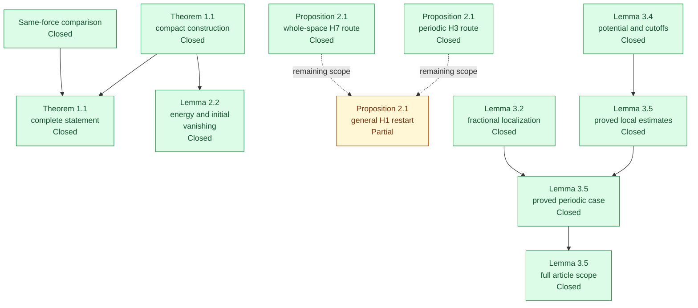
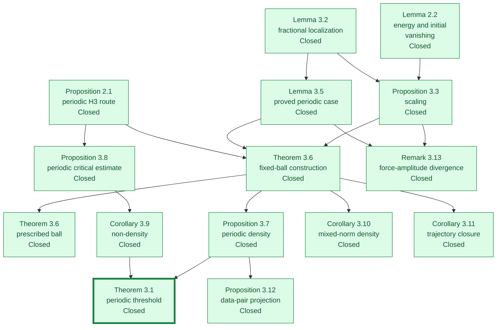
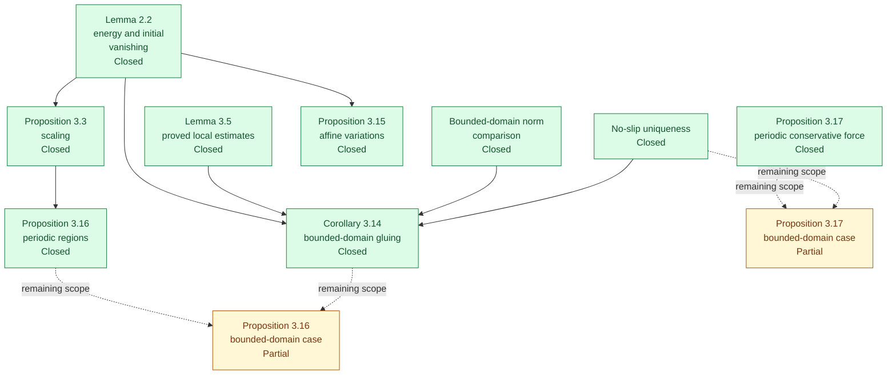
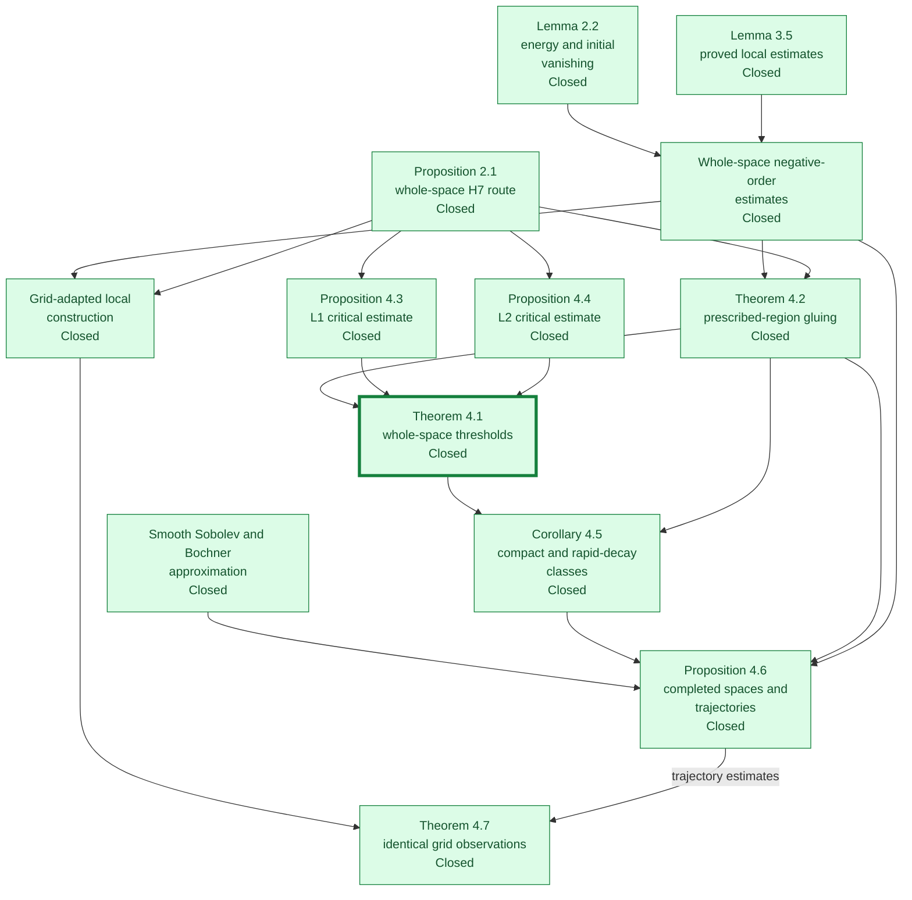

# Article proof dependencies and formalization coverage

The project formalizes the two main density theorems, **Theorems 3.1 and 4.1**, and the proved cases used in their arguments. The diagrams follow the paper's mathematical reductions, rather than Lean imports or implementation task IDs.

**Green = Closed. Orange = Partial.** The status belongs to the exact clause written in each node. A single article proposition can therefore have both green and orange nodes. Closed requires a Lean kernel-checked proof with all auxiliary results formally proved and instantiated. It introduces no assumptions beyond those explicitly stated in the article (for example, positive viscosity). Only the standard logical axioms `propext`, `Classical.choice` and `Quot.sound` are permitted.

**Solid arrows** are dependencies of the proved argument. **Dashed arrows** connect available proved components to an unfinished extension or remaining clause; they do not assert that the extension has been proved. Orange branches are not inputs to the green main-theorem paths. Repeated nodes in different panels denote the same result.

The periodic argument splits into a construction/density branch and a critical regularity/non-density branch. The whole-space argument has the same structure, with separate low-frequency estimates and two critical norms. The formal continuation routes use the proved H3/H7 cases of Proposition 2.1.

## Shared construction and local theory

## The periodic main theorem and its consequences

## Bounded domains and secondary constructions

## The whole-space main theorem and its consequences

## Split article statements

A whole-statement row is Partial whenever an unfinished clause remains. This does not downgrade the proved cases or downstream results that use only those cases.

| Article statement | Closed part used in the proofs | Partial scope |
|---|---|---|
| Proposition 2.1 | Periodic existence, uniqueness, maximality and continuation for the used force class, using the formally proved H3 restart case.; Whole-space existence, uniqueness, maximality and continuation for the used force class, using fixed-force H7 restart. | The general H1-uniform restart clauses remain unformalized. They are not inputs to the proved H3/H7 continuation routes. |
| Proposition 3.16 | Place finitely many rescaled building blocks in prescribed disjoint periodic regions and sum them. | The bounded-domain no-slip variant has not been assembled. |
| Proposition 3.17 | Potential-force pairing vanishes and the solution from rest has zero velocity on the torus. | The bounded-domain conservative-force variant is not exported. |

## Proof locations

| Node | Status | Exact scope and Lean source |
|---|---|---|
| Theorem 1.1: compact construction | Closed | The compact candidate, energy bound and early-zero interval at every positive viscosity. [ViscosityPacket.lean](../../formalization/NSFormalization/Source/ViscosityPacket.lean) |
| Same-force comparison | Closed | For every positive viscosity, any compact candidate excludes a global smooth same-force solution with uniformly bounded kinetic energy. All reference bounds follow from its proved smoothness, compact support and energy bound. [PacketBreakdown.lean](../../formalization/NSFormalization/Source/PacketBreakdown.lean); [BoundedViscosityUniqueness.lean](../../formalization/NSFormalization/Source/BoundedViscosityUniqueness.lean); [WholeSpaceUniqueness.lean](../../vendor/NavierStokesAndEuler/NavierStokes/R3/WholeSpaceUniqueness.lean) |
| Theorem 1.1: complete statement | Closed | One time-one compact candidate and its same-force global nonexistence conclusion for every positive viscosity, proved by source_breakdown. [PacketBreakdown.lean](../../formalization/NSFormalization/Source/PacketBreakdown.lean); [ProblemStatement.lean](../../vendor/NavierStokesAndEuler/NavierStokes/R3/ProblemStatement.lean) |
| Proposition 2.1: periodic H3 route | Closed | Periodic existence, uniqueness, maximality and continuation for the used force class, using the formally proved H3 restart case. [TorusLocalTheory.lean](../../verification/Bindings/TorusLocalTheory.lean); [ExistenceInputH3.lean](../../formalization/NSFormalization/Section3/T11/ExistenceInputH3.lean) |
| Proposition 2.1: whole-space H7 route | Closed | Whole-space existence, uniqueness, maximality and continuation for the used force class, using fixed-force H7 restart. [LocalTheoryV2.lean](../../verification/Bindings/LocalTheoryV2.lean); [ShiftedExtension.lean](../../formalization/NSFormalization/Section4/A04/ShiftedExtension.lean) |
| Proposition 2.1: general H1 restart | Partial | The general H1-uniform restart clauses remain unformalized. They are not inputs to the proved H3/H7 continuation routes. [LocalTheoryV2.lean](../../verification/Bindings/LocalTheoryV2.lean); [TorusLocalTheory.lean](../../verification/Bindings/TorusLocalTheory.lean) |
| Lemma 2.2: energy and initial vanishing | Closed | Finite energy and dissipation, the energy identity and an initial zero interval for the selected candidate. [PacketImport.lean](../../verification/Bindings/PacketImport.lean); [Quiet.lean](../../formalization/NSFormalization/Section4/I01/Quiet.lean) |
| Lemma 3.2: fractional localization | Closed | Local-to-torus Sobolev comparison, including the endpoint identities. [Assembly.lean](../../formalization/NSFormalization/Section3/T13/Assembly.lean) |
| Proposition 3.3: scaling | Closed | Energy, mixed-norm and Sobolev scaling of the compact building block. [Assembly.lean](../../formalization/NSFormalization/Section3/T15/Assembly.lean) |
| Lemma 3.4: potential and cutoffs | Closed | Construct a local vector potential and divergence-free cutoff modification. [Assembly.lean](../../formalization/NSFormalization/Section3/T16/Assembly.lean) |
| Lemma 3.5: proved local estimates | Closed | Local support, derivative, energy and mixed-norm bounds with the smoothness and geometric hypotheses supplied by a smooth reference solution. [Reference.lean](../../formalization/NSFormalization/Section4/I02/Reference.lean); [Correction.lean](../../verification/Bindings/Correction.lean) |
| Lemma 3.5: proved periodic case | Closed | The formal periodic correction theorem with its explicit smoothness, chart and viscosity hypotheses; those hypotheses are supplied in the fixed-ball construction. [Assembly.lean](../../formalization/NSFormalization/Section3/T17/Assembly.lean); [SlabBridge2.lean](../../formalization/NSFormalization/Section3/T17/SlabBridge2.lean) |
| Lemma 3.5: full article scope | Closed | Lemma 3.5 for a periodic classical reference on [0,T+δ), positive viscosity, the building-block placement and Lemma 3.4 ball. The zero extension is identified on the slab; all 45 API fields and the displayed derivative, support, energy, mixed and Sobolev bounds are retained, with the force identified globally with the article reference. [ArticleScope.lean](../../formalization/NSFormalization/Section3/T17/ArticleScope.lean); [Correction3V2.lean](../../verification/Bindings/Correction3V2.lean) |
| Theorem 3.6: fixed-ball construction | Closed | Construct the scaling and correction inputs from raw data; exact lifespan, history and convergence for the fixed-ball case used in density. [Threading.lean](../../formalization/NSFormalization/Section3/T19/Threading.lean) |
| Theorem 3.6: prescribed ball | Closed | Theorem 3.6 from raw data for every prescribed positive-radius coordinate ball whose closure lies in the interior of the fundamental cube. The registered packet supplies the building block; only article hypotheses are arguments. Includes exact lifespan, blowup, history, divergence-free single-chart shrinking support, simultaneous energy/mixed/Sobolev bounds and negative-order convergence. [ThreadingAt.lean](../../formalization/NSFormalization/Section3/T19/ThreadingAt.lean); [FromData.lean](../../formalization/NSFormalization/Section3/T19/FromData.lean); [PeriodicInsertionV2.lean](../../verification/Bindings/PeriodicInsertionV2.lean) |
| Proposition 3.7: periodic density | Closed | The two-case lifespan argument needs only one fully constructed localization, not the prescribed-ball extension. [Assembly.lean](../../formalization/NSFormalization/Section3/T19/Assembly.lean) |
| Proposition 3.8: periodic critical estimate | Closed | Small critical forcing gives regularity through the proved H3 continuation route. [Assembly.lean](../../formalization/NSFormalization/Section3/T20/Assembly.lean) |
| Corollary 3.9: non-density | Closed | A nonempty open regularity ball and Sobolev monotonicity exclude density at and above the threshold. [MainAssembly.lean](../../formalization/NSFormalization/Section3/T21/MainAssembly.lean) |
| Theorem 3.1: periodic threshold | Closed | Combine subcritical fixed-datum density and the zero-datum non-density obstruction. [MainAssembly.lean](../../formalization/NSFormalization/Section3/T21/MainAssembly.lean) |
| Corollary 3.10: mixed-norm density | Closed | Use the same two-case argument and the positive mixed-norm scaling exponent. [Assembly.lean](../../formalization/NSFormalization/Section3/T19/Assembly.lean) |
| Corollary 3.11: trajectory closure | Closed | Energy and force convergence for one constructed family around a smooth reference. [Assembly.lean](../../formalization/NSFormalization/Section3/T19/Assembly.lean) |
| Proposition 3.12: data-pair projection | Closed | Fixed-initial-data density gives product density and surjectivity onto the initial-data class. [Assembly.lean](../../formalization/NSFormalization/Section3/T19/Assembly.lean) |
| Remark 3.13: force-amplitude divergence | Closed | For every inserted family, the force-difference supremum is at least epsilon^(-3) times the positive finite packet-force amplitude minus correction.forceProfileConst(0) times epsilon^(-2), and diverges as epsilon decreases to zero. Packet forcing is nonzero by energy and blowup; includes the constructed T19 fixed-ball family. Extended amplitudes tend to nhds top and finite real amplitudes to atTop. [ForceAmplitude.lean](../../formalization/NSFormalization/Section3/T18/ForceAmplitude.lean); [ForceAmplitude.lean](../../formalization/NSFormalization/Section3/T19/ForceAmplitude.lean); [ForceAmplitude.lean](../../verification/Bindings/ForceAmplitude.lean); [ForceAmplitude.lean](../../verification/Tests/ForceAmplitude.lean) |
| Bounded-domain norm comparison | Closed | Restriction and zero-extension estimates for compactly supported interior perturbations. [Assembly.lean](../../formalization/NSFormalization/Section3/T22/Assembly.lean) |
| No-slip uniqueness | Closed | The classical uniqueness theorem on the bounded domain is formally proved. [NoSlipUniqueness.lean](../../formalization/NSFormalization/Section3/T23/NoSlipUniqueness.lean) |
| Corollary 3.14: bounded-domain gluing | Closed | The final raw-data theorem constructs its packet, placement and norm witnesses internally in the prescribed interior ball. [BoundaryInsertionV2.lean](../../verification/Bindings/BoundaryInsertionV2.lean) |
| Proposition 3.15: affine variations | Closed | Compact divergence-free perturbations of the selected building block give the affine family. [AffineVariation.lean](../../verification/Bindings/AffineVariation.lean) |
| Proposition 3.16: periodic regions | Closed | Place finitely many rescaled building blocks in prescribed disjoint periodic regions and sum them. [MultipleAssembly.lean](../../formalization/NSFormalization/Section3/T24/MultipleAssembly.lean) |
| Proposition 3.16: bounded-domain case | Partial | The bounded-domain no-slip variant has not been assembled. [Multiple.lean](../../formalization/NSFormalization/Section3/T24/Multiple.lean) |
| Proposition 3.17: periodic conservative force | Closed | Potential-force pairing vanishes and the solution from rest has zero velocity on the torus. [ConservativeAssembly.lean](../../formalization/NSFormalization/Section3/T24/ConservativeAssembly.lean) |
| Proposition 3.17: bounded-domain case | Partial | The bounded-domain conservative-force variant is not exported. [ConservativeAssembly.lean](../../formalization/NSFormalization/Section3/T24/ConservativeAssembly.lean) |
| Whole-space negative-order estimates | Closed | Fourier scaling and low-frequency control of compact force profiles; the positive and negative norm bounds needed for the subcritical limits. [HomogeneousScaling.lean](../../formalization/NSFormalization/Section4/I03/HomogeneousScaling.lean); [ScalingNorms.lean](../../verification/Bindings/ScalingNorms.lean) |
| Theorem 4.2: prescribed-region gluing | Closed | For every prescribed nonempty open set, construct one family from the given reference, with exact lifespan, blowup, history, compact support, energy bound and all subcritical force limits. The building block is selected before the reference and region. [InsertionFromData.lean](../../verification/Bindings/InsertionFromData.lean); [InsertionLifespan.lean](../../verification/Contracts/V2/InsertionLifespan.lean) |
| Proposition 4.3: L1 critical estimate | Closed | The whole-space critical estimate with the proved high-order continuation route. [Universal.lean](../../formalization/NSFormalization/Section4/R43/Universal.lean) |
| Proposition 4.4: L2 critical estimate | Closed | The finite-horizon inhomogeneous critical estimate at zero initial velocity. [Prop44.lean](../../formalization/NSFormalization/Section4/R44/Prop44.lean) |
| Theorem 4.1: whole-space thresholds | Closed | Combine subcritical density from the constructed case with the two critical non-density obstructions. [MainThresholds.lean](../../verification/Bindings/MainThresholds.lean) |
| Corollary 4.5: compact and rapid-decay classes | Closed | Compactly supported force changes preserve both subclasses; the same critical regularity balls give the converse. [ForceClasses.lean](../../verification/Bindings/ForceClasses.lean) |
| Smooth Sobolev and Bochner approximation | Closed | Approximate completed data by smooth compactly supported fields and time profiles. [Spatial.lean](../../formalization/NSFormalization/Section4/B01/Spatial.lean); [Temporal.lean](../../formalization/NSFormalization/Section4/B01/Temporal.lean) |
| Proposition 4.6: completed spaces and trajectories | Closed | Combine smooth approximation, compact-force density and the simultaneous energy and force estimates for one family. [CompletedDensity.lean](../../verification/Bindings/CompletedDensity.lean) |
| Grid-adapted local construction | Closed | Construct a ball inside a common cell and prove vanishing cell integrals for the localized perturbation. [GridAssembly.lean](../../verification/Bindings/GridAssembly.lean); [FluxCancellation.lean](../../verification/Bindings/FluxCancellation.lean) |
| Theorem 4.7: identical grid observations | Closed | Use the internally constructed common-cell ball, cancellation and simultaneous convergence estimates. [GridObservations.lean](../../verification/Bindings/GridObservations.lean) |

## Verification and source data

The article-level inventory has **24 Closed and 3 Partial entries** (26 numbered statements and one numbered remark). These counts are distinct from the number of clause-level nodes above. The recorded kernel audit checks **69 declarations**, with **no forbidden axioms**. The permitted logical axioms are `propext`, `Classical.choice` and `Quot.sound`; the retained source scan has no admissions or custom axiom declarations.

The graph is generated from [proof_graph.json](proof_graph.json). [RESULT_MAP.md](RESULT_MAP.md) supplies declaration locations, [CLOSURE_AUDIT.md](CLOSURE_AUDIT.md) records the input review, and [AXIOM_AUDIT.json](AXIOM_AUDIT.json) records the kernel results. The implementation registry in `tasks.json` is used for package checks, not as the reader-facing proof graph.

Run `python3 experiments/check_formalization_plan.py` to regenerate this file; `make check` verifies coverage agreement, acyclicity, displayed edges, source paths and the rule that a Closed proof cannot depend on a Partial node.
