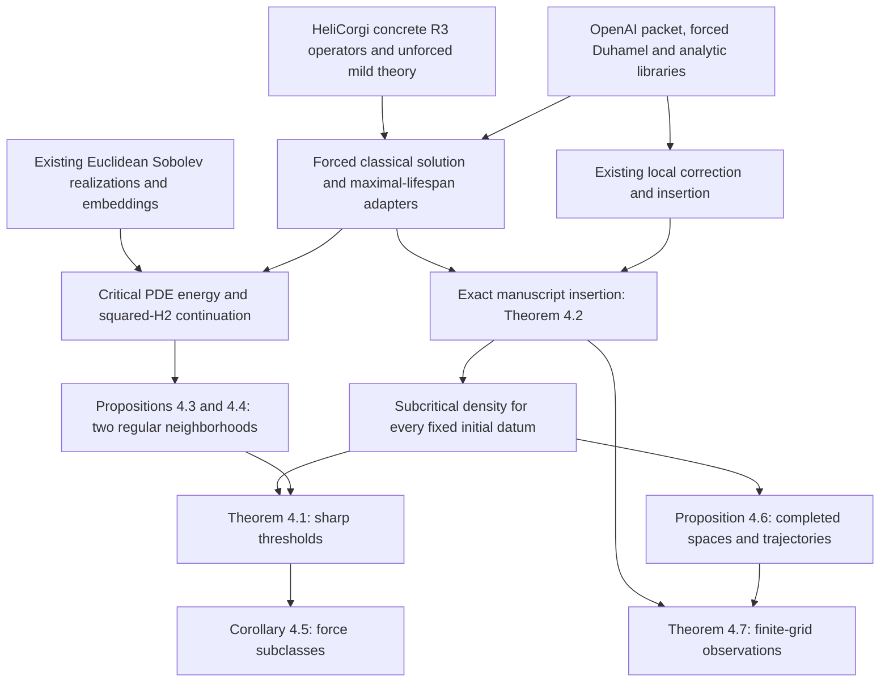

# Section 4 proof task tree

The priority is the merged article's **Section 4, The whole space**, formerly
Paper 3. The target files are [blowup_density.tex](../../paper/blowup_density.tex)
and [blowup_density.pdf](../../output/pdf/blowup_density.pdf). The original
Paper 1 and Paper 3 TeX/PDF pairs remain in
[paper/originals/local](../../paper/originals/local/).

This is a reorganization of future work. No new Lean code was written and no
existing Lean proof was modified. Full manuscript certification remains open.

- [Dependency graph and exact task contracts](DEPENDENCY_GRAPH.md)
- [Machine-readable task graph](tasks.json)
- [All 34 source occurrences / 28 merged results](RESULT_MAP.md)
- [External reuse, exact interface differences and source audit](EXTERNAL_REUSE.md)
- [Source hashes and upstream provenance](../../logs/FORMALIZATION_SOURCE_MANIFEST.json)
- [Current static verification](../../logs/FORMALIZATION_PLAN_CHECK.json)

## The reduced proof architecture

Section 4 does not depend on completion of the periodic local solver, mean-zero
torus fractional embedding, periodization, boundary corollary, or Paper 1 main
theorem. It does reuse the **Euclidean** vector potential and correction in
Lemmas 3.4 and 3.5. Existing files may remain in the `Paper1` namespace even
when their mathematics is useful on the whole space; namespace renaming is not
a prerequisite. In particular `Paper1/SchwartzCriticalEmbedding.lean` is a
whole-space component and must not be discarded with deferred periodic work.

## Execution order

1. **P0: reuse and interface closure.** Resolve the two upstream toolchains;
   identify exact real-vector Fourier/Sobolev coordinates, pressure and time
   conventions; connect existing forced Duhamel and unforced concrete R3
   theories to the manuscript's common-interval classical solution class.
   Reuse uniqueness/restart and establish the exact squared-H2 criterion.
   Finish only the application-level critical embedding adapters.
2. **P1: main Section 4 statements.** Assemble exact insertion and the two-case
   density branch; then derive the two actual PDE critical estimates and the
   sharp zero-data classification. The density branch can advance without
   waiting for critical non-density.
3. **P2: consequences.** Transfer to compact/rapid-decay forces, finish the
   homogeneous completion and simultaneous trajectory convergence, and attach
   the existing actual finite-grid observations. Completed-space density only
   needs subcritical compact-force density, not the endpoint converse.
4. **P3: Section 3.** Revisit periodic mean/pressure/domain transfers, the torus
   main theorem and secondary results after the whole-space mainline.

The 30 nodes in `tasks.json` include upstream inputs, adapters, final assemblies
and deferred work. They are not 30 missing analytic theories. The required new
work is concentrated at interfaces and manuscript-specific energy/topology
arguments. Do not reopen the Fourier, Leray, heat, Picard, Young or compact
packet foundations merely because a final manuscript theorem is still open.

## Exact acceptance conditions

For Theorem 4.1, keep `q in {1,2}` and `s_q=2/q-3/2`; density is for every fixed
initial datum below the threshold, while the if-and-only-if statement is at
zero initial velocity. Arbitrary backgrounds may already break down by T;
only a reference regular beyond T supports an inserted solution with exact
lifespan T and unchanged earlier history.

For Proposition 4.4, keep the inhomogeneous negative norm and the
time-dependent radius `c nu^(3/2) exp(-C nu S)`. A global regularity claim from
that same fixed radius would change the theorem. For Proposition 4.6, the
homogeneous norm applies to the compact difference, and density in rough
Bochner spaces does not define classical lifespans for rough forcing.

A future task is complete only when its concrete output matches these
hypotheses, represents the same physical fields, builds under a documented
toolchain and has an appropriate transitive axiom audit. A literature theorem
can support the mathematical plan without being an accepted Lean axiom.
The copied `Citations/` declarations and the admitted boundary theorem are not
certification shortcuts.

## Handoff

The next bounded implementation task is U05/D01/A01: select the smallest
compatible OpenAI/HeliCorgi import closure and formulate the forced
whole-space solution adapter, preserving pressure-gradient and common-interval
requirements. Compare the existing OpenAI forced cylinder route against an
affine-forcing extension of HeliCorgi's concrete endpoint-safe R3 route before
choosing one implementation. No new proof implementation was attempted here.
